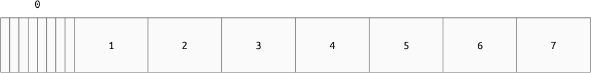
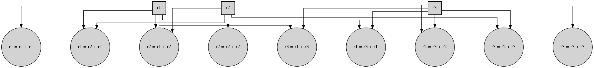

Low Level Computation
=====================

Main Memory
-----------

The memory of a computer is an ordered sequence of bits, which is broken up into
small fixed sized pieces called :ref:`"bytes" <byte>`. A :ref:`byte <byte>` is
the smallest addressable unit of bits. This is eight :ref:`bits <bit>`, except
for very old computers or some specialty devices. These :ref:`bytes <byte>` are
laid out as a flat sequence which are named according to their index. When
discussing memory, an index is called an :ref:`"address" <address>`. To
:ref:`"dereference" <dereference>` an address is to read the value stored at
that address.

Computation Circuits
--------------------

A general purpose computer can perform many different tasks, even tasks not
known when the device was built. To do this, the computer has many small
computation circuits that implement very low level functions, for example: add
two numbers together. Using "add" as an example, at a high level this circuit
will take two numbers and produce the sum. To do that, it needs a physical
location to store the input bits and the output bits. These circuits take up
physical space and material so it would be prohibitively expensive to build
custom hardware to special case adding every address to every other address
(quadratic in the number of addresses). This problem is magnified by the desire
to perform many operations, like subtract, multiply, and probably others. To
reduce the number of specific circuits needed, the computer provides a small set
of locations to read and write data and provides operations for moving data from
:ref:`main memory <main-memory>` to and from these standard locations. These
locations are individually called :ref:`"registers" <register>`. For example,
the ``add`` implementation for a 3 :ref:`register <register>` machine would
require 9 adder circuits, where one of the inputs gets overwritten with the
output.

Bitness
-------

A :ref:`register <register>` is not limited to a single byte. If it were, our
memory space would be limited to :math:`2^{8} = 256` bytes because that would be
the largest address we could store in a single register. The number of bits in a
register is the :ref:`"bitness" <bitness>` of the machine. This is what it means
when you see "64 bit processor" or "32 bit processor".

Increasing the bitness of the :ref:`registers <register>` is advantageous
because it means the machine has special circuits for operating on larger
integers and it increases the total addressable memory space. For example, the
theoretical size of the memory space is:

- 8 bits: :math:`2^{8} = 256` bytes
- 16 bits: :math:`2^{16} = 65536B = 64KiB`
- 32 bits: :math:`2^{32} = 4294967296B = 4GiB`
- 64 bits: :math:`2^{64} = 18446744073709551616B = 16EiB`

The downsides to increasing the bitness of the :ref:`registers <register>` is
that it requires physically more material and space to build. Electricity only moves
about one foot in a nanosecond, so routing the electricity around a lot of
physical space takes time. Making things smaller also makes them harder to keep
cool enough to function properly. Another downside is that in exchange for a
larger memory space, the size of every address goes up. This trade-off is okay
if you actually have more memory, but can lead to some complications.

Sequencing Low Level Operations
-------------------------------

Given our pile of bytes and very specific computation circuits, how can we
perform useful computations? We need to first decompose our problem into these
small atomic steps, and then instruct the computer which atomic steps we want to
execute and in what order. To do this, we could either:

1. Build a custom circuit to sequence the low level circuits.
2. Encode the steps as data and store the sequence in memory.

The problem with option 1 is that we either need to know what function we want
to perform when we build the hardware, or we would need some sort of mechanism
for re-synthesizing the circuits after the device is built. There is actually a
type of device that does this, called an FPGA (Field Programmable Gate Array),
but that is not the option most modern general purpose computers use.

Option two requires that we can encode all of the tasks we want into bits and
get the computer to read them when we want.

Encoding Operations as Numbers
~~~~~~~~~~~~~~~~~~~~~~~~~~~~~~

A single encoded operation is referred to as an :ref:`"instruction"
<instruction>`. An instruction refers to both the function to perform paired
with the arguments to act on.

Encoding our low level operations as numbers is a reasonably straightforward
task. Given that we have a finite number of atomic operations, we could just
enumerate them and use the index as the value to store in memory. The downside
with that technique is that it forces all instructions to be the same size,
which means all instructions are as large as the largest possible
instruction. In practice, not all instructions need the same amount of
information. For example: ``inc``, which increments a value by one, is composed
of two parts:

1. Something to indicate that this is an ``inc``.
2. Something to denote which register should be incremented.

Where ``add`` requires 3 pieces:

1. Something to indicate that this is an ``add``.
2. Something to denote the register to read the first addend from.
3. Something to denote the register to read the second addend from. This
   register will then hold the result.

In general, each instruction is encoded as an :ref:`"opcode" <opcode>` followed
by a variable amount of space depending on the number of arguments needed. The
processor knows how many bytes to read after the opcode because the number of
arguments is fixed for any particular opcode. For example, in some fictional
encoding we could encode:

.. code-block:: asm

   inc %r1
   add %r2, %r3

as:

::

   00000001 00000001
    inc = 1   r1 = 1

   00000010 00000010 00000011
    add = 2   r2 = 1   r3 = 3

Given the complexity of all of the operations modern X86-64 computers can
perform, the actual encoding is very complicated and a single instruction can
span anywhere from 1 byte to 15 bytes!

Telling the Computer Where the Program Is
~~~~~~~~~~~~~~~~~~~~~~~~~~~~~~~~~~~~~~~~~

So we can now encode a computation as a series of atomic steps that our computer
can execute, but how does the computer read that?

When the computer launches, there is a small program hard coded into the device
that reads some startup code from your persistent storage and loads it into
memory at a known location. The processor then knows to read instructions
starting at this location and moving forward one instruction at a time. The
computer stores the current :ref:`address <address>` where the program is being
read in a special :ref:`register <register>` called the :ref:`"instruction
pointer" <instruction-pointer>`.

The general execution flow for a program is:

1. :ref:`Dereference <dereference>` the :ref:`instruction pointer
   <instruction-pointer>`.
2. Parse the given :ref:`instruction <instruction>` by reading the :ref:`opcode
   <opcode>` and any arguments.
3. Execute the :ref:`instruction <instruction>`.
4. Increment the :ref:`instruction pointer <instruction-pointer>` by the size of
   the :ref:`instruction <instruction>`..
5. Go to step 1.

.. note::

   There are cases where step 4 is altered or skipped. This happens when the
   instruction itself changes the instruction pointer.
